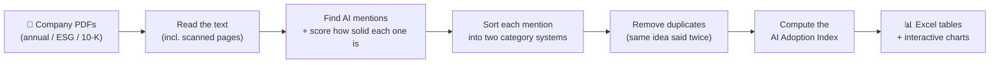

# AI Semantic Analyzer

**A tool that reads company reports and measures how much each company is really using artificial intelligence.**

Companies talk about AI everywhere — in annual reports, sustainability (ESG) reports, and regulatory filings. But talk is cheap, and not every mention means real adoption. This tool reads those documents the way a careful analyst would: it finds every place AI is mentioned, works out whether the mention is substantive or just buzzwords, sorts each mention into a category, and turns the whole picture into a single, comparable **AI Adoption Index** score per company per year.

It is designed for researchers, analysts, and anyone who needs an objective, repeatable way to compare AI adoption across companies and over time — no programming required to run it.

---

## What it does, in plain terms



1. **Reads the documents.** It opens each PDF and pulls out the text — even from scanned, image-only pages when needed.
2. **Finds genuine AI mentions.** It looks for AI-related language and judges whether each mention is real and substantive (a deployed system, an investment, a named technology) or just marketing fluff or a risk-disclaimer. Weak mentions are kept but counted for much less; statements like *"AI may pose risks"* are recognised as **not** evidence of adoption.
3. **Classifies every mention twice**, under two complementary category systems (see [Two ways of categorising AI](#two-ways-of-categorising-ai) below).
4. **Removes duplicates** so the same point made five times doesn't inflate the score.
5. **Calculates the AI Adoption Index** — one headline number (0–100) built from seven ingredients such as how often AI appears per page, how diverse the uses are, how concrete the commitments are, and how forward-looking the language is.
6. **Exports everything** to Excel spreadsheets and interactive charts you can open in a browser.

> **How is the score actually calculated?** Every formula is explained in plain language, with worked examples, in **[`app/AI_ADOPTION_INDEX_EXPLAINED.md`](app/AI_ADOPTION_INDEX_EXPLAINED.md)** — written for readers with an economics background, not statistics or programming.

---

## What you need to provide

- **A folder of PDF reports.** Each file should be named in this pattern so the tool can read the company, year, and document type automatically:

  ```
  {Rank}. {Company Name} - {Year} - {Document Type}.pdf
  ```
  Examples:
  - `1. Walmart - 2024 - Annual Report.pdf`
  - `38. Microsoft - 2023 - 10K.pdf`

- **(Optional) a company metadata CSV** giving each company's sector, industry, and country, so results can be grouped and compared. Without it, the tool still runs.

---

## What you get back

All results are written to a `RESULT/` folder:

| File | What's inside |
|------|---------------|
| `ai_references_raw.xlsx` | Every AI mention found, with its surrounding context and scores |
| `ai_references_deduplicated.xlsx` | The same, after removing repeated mentions |
| `ai_adoption_index.xlsx` | The headline AI Adoption Index per company per year (plus a breakdown by document type) |
| `eu_classification.xlsx` | How mentions map onto the European Commission's AI capability categories |
| `charts/*.html` | Interactive charts (rankings, trends, category breakdowns) you open in a web browser |
| `ai_adoption_analysis.db` | A database holding all of the above (for advanced users) |

Every spreadsheet also carries a small **Metadata** sheet recording exactly how and when it was produced, so any result can be traced back and reproduced.

---

## Two ways of categorising AI

Each AI mention is sorted under **two** category systems at once, because each answers a different question:

**1. The "classic" system — what is AI used *for*, and *which* technology?**

- *AI Applications (7):* Strategic Transformation · Operational Optimization · Customer & Service Intelligence · Product & Innovation · Data & Decision Intelligence · Risk, Security & Governance · Human Capital & Workforce
- *AI Technologies (8):* Traditional Machine Learning · Deep Learning · Natural Language Processing · Generative AI & LLMs · Computer Vision · Robotics & Autonomous Systems · AI Infrastructure · General/Unspecified AI

**2. The EU system — *which AI capability* is involved?**

Based on the European Commission's Joint Research Centre "AI Watch" framework: 8 capability domains (Reasoning, Planning, Learning, Communication, Perception, Integration & Interaction, Services, AI Ethics & Philosophy) broken into 12 subdomains.

A mention can land in both systems, in only one, or — if nothing matches — be left unclassified in that system. The two are scored independently.

---

## Running it

```bash
cd app
python main.py
```

The first time you run it, a short setup wizard asks for your PDF folder, the optional metadata CSV, and where to put results. Your answers are saved, so subsequent runs start immediately. From there, an on-screen menu walks you through processing, analysis, and export.

**Requirements:** Python 3.11 or newer. Install the dependencies once with:

```bash
pip install -r requirements.txt
```

(Optional add-ons improve sentiment analysis and let it read scanned PDFs — see [`app/APP_DESCRIPTION.md`](app/APP_DESCRIPTION.md).)

---

## Learn more

- **[`app/AI_ADOPTION_INDEX_EXPLAINED.md`](app/AI_ADOPTION_INDEX_EXPLAINED.md)** — how the index and all the scores are calculated, in plain language for an economics audience.
- **[`app/APP_DESCRIPTION.md`](app/APP_DESCRIPTION.md)** — the technical reference for developers who want to understand or extend the code.

---

## License

Developed for academic research. Please contact the author regarding other uses.
