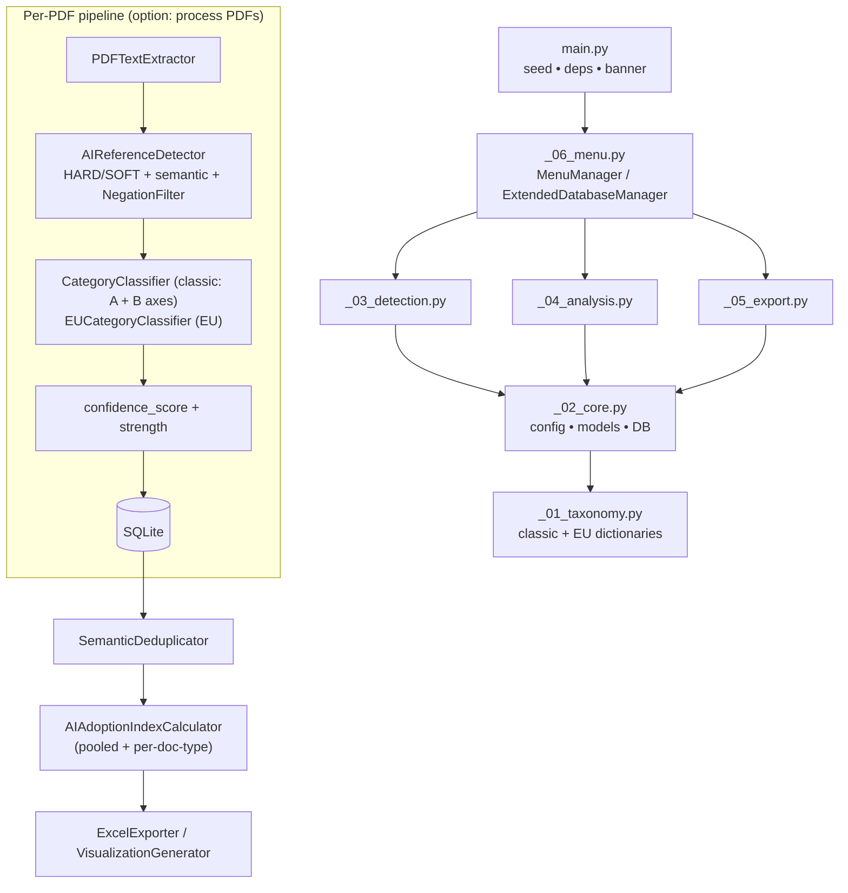

# Developer & Extension Reference

Technical description of every module, the data flow, the database schema, and
the main extension points. For the end-user overview see the root `README.md`;
for the index/statistics maths see `AI_ADOPTION_INDEX_EXPLAINED.md`; for the
per-mention confidence score in full detail see `CONFIDENCE_SCORE_EXPLAINED.md`.

## Purpose

An NLP pipeline that extracts AI-related references from corporate documents
(annual reports, sustainability/ESG reports, proxies, 10-Ks), classifies each
reference under **two taxonomies in one pass**, and aggregates them into a
multi-dimensional **AI Adoption Index** per company-year.

- **Classic taxonomy** — two **independent** axes scored separately for every
  reference: 7 AI Applications (`category_a`, A1–A7, "what for?") and 8 AI
  Technologies (`category_b`, B1–B8, "what technology?"). A reference may match
  an A-category, a B-category, both, or `none` on either axis.
- **EU_Semantics taxonomy** — European Commission JRC "AI Watch": 8 domains /
  12 subdomain leaves.

Both taxonomies are applied to the same detected reference. The classic axes
carry no fallback, so `none` is a legitimate value; a detected reference that is
`none` on A, B **and** EU is flagged by an integrity counter (expected ~0).

## Architecture & data flow

Modules are prefixed by dependency order (`_01_` … `_06_`); `main.py` is the
entry shell and sits outside the numbering. Each module imports only from
lower-numbered ones.

## Inputs

- `*.pdf` in `input_folder`, named `"{Position}. {Company} - {Year} - {DocType}.pdf"`
  (parsed by `FilenameParser`).
- Optional company-metadata CSV (config key `company_metadata_csv`; legacy
  `fortune500_csv` still read as a fallback) supplying position / sector /
  industry / country.
- `analyzer_config.json` — written by the first-run wizard.

## Outputs (under `RESULT/`)

- `ai_references_raw.xlsx` — all detections, with separate `Category A` and
  `Category B` columns (+ `Metadata` provenance sheet).
- `ai_references_deduplicated.xlsx` — semantically deduplicated set.
- `ai_adoption_index.xlsx` — pooled company-year index (classic + EU columns)
  plus an `adoption_index_by_doctype` sheet.
- `eu_classification.xlsx` — EU_Semantics domain/subdomain distribution.
- `ai_adoption_analysis.db` — SQLite store.
- `charts/*.html` — Plotly visualizations (incl. `viz_eu_sunburst`,
  `viz_taxonomy_comparison`).
- `ai_analyzer.log` — runtime log (records the deterministic seed at startup).

## Modules

### `main.py` — entry point
- **Deterministic seed block runs before any heavy import**: sets
  `PYTHONHASHSEED`, seeds `random` / `numpy` / `torch` (CPU + CUDA), and forces
  `cudnn.deterministic` + `use_deterministic_algorithms`. `SEED = 42`.
- Validates Python ≥ 3.11, prints banner + feature list, verifies required and
  optional dependencies, then hands control to `_06_menu.main()`.

### `_01_taxonomy.py` — taxonomy dictionaries
- `AI_APPLICATIONS` (A1–A7) and `AI_TECHNOLOGIES` (B1–B8); each category exposes
  `name`, `description`, `keywords`, `patterns`, and `keyword_tiers`
  (1 = high, 2 = medium, 3 = low confidence).
- `EU_SEMANTICS` — 12 leaves, each with `domain`, `domain_code`, `subdomain`,
  `keywords`, `keyword_tiers`; helpers `get_eu_info`, `get_eu_keyword_tier`, and
  the derived `EU_DOMAINS`, `EU_LEAF_UNITS`.
- `FALLBACK_NAME_TO_CODE` — legacy map from human-readable category names to
  classic codes; retained for reference but **no longer used** by the dual-axis
  `CategoryClassifier` (classic classification has no fallback).
- Keyword-collection helpers: `get_all_application_keywords`,
  `get_all_technology_keywords`, `get_all_eu_keywords`.
- **No imports from other project modules.**

### `_02_core.py` — configuration, models, database
- `AnalyzerConfig` — paths, semantic thresholds, deduplication threshold,
  per-dimension index `weights` (validated to sum to 1.0 in `__post_init__`),
  `parallel_threads`. Default `database_name = "ai_adoption_analysis.db"`.
- Data models:
  - `AIReference` — one detected mention; carries the dual classic axes
    `category_a` / `category_b` (each plus a `*_confidence`), sentiment/semantic
    scores, `reference_strength`, `confidence_score`, `confidence_reasons`,
    `is_negated_context`, and the EU fields `eu_domain` / `eu_subdomain` /
    `eu_confidence`.
  - `DocumentResult` — per-PDF aggregate.
  - `AIAdoptionIndex` — per company-year; the 7 sub-indices, `ai_adoption_index`,
    and the EU parallels `diversity_index_eu` / `ai_adoption_index_eu` /
    `categories_used_eu`.
- `DatabaseManager` — idempotent schema with guarded `ALTER TABLE` migrations
  (EU and dual-axis `category_a` / `category_b` columns are appended to existing
  tables; row reads use **name-based** access so column order is irrelevant).
  Tables: `ai_references_raw`, `ai_references_deduplicated`, `adoption_index`,
  and `adoption_index_by_doctype` (`UNIQUE(company, year, doc_type)`).
- Re-exports `AI_CATEGORIES` (combined classic dict), `EU_CATEGORIES`,
  `FALLBACK_NAME_TO_CODE`. Constants: `FALSE_POSITIVE_PATTERNS` (~60),
  `AI_CONTEXT_VALIDATORS`, robotics/RPA pattern lists, `PARALLEL_THREADS`.

### `_03_detection.py` — extraction, detection, classification
- `PDFTextExtractor` — pdfplumber primary, PyMuPDF fallback, optional Tesseract
  OCR; `is_text_corrupted()` flags encoding damage / scan-only PDFs.
- `SemanticModelLoader` — thread-safe singleton around `all-MiniLM-L6-v2`.
- `AIReferenceDetector` — HARD vs SOFT pattern gating, semantic fallback
  (threshold 0.60 standard / 0.68 strict), `_compute_confidence_and_strength`
  (trigger-type base score + implementation/specificity bonuses − marketing /
  ESG-boilerplate penalties), and actionability/specificity validators.
- `NegationFilter` — applied post-detection: hard negations drop the reference;
  soft (risk-factor/hypothetical) negations set `is_negated_context=True`,
  multiply `confidence_score` by 0.4, and demote strength to `mention_only`.
- `CategoryClassifier` (classic) and `EUCategoryClassifier` (EU) — score each
  bucket by `0.5 × #pattern-matches + 0.2 × #keyword-matches`, normalize by
  `/1.5`. The classic classifier is **dual-axis**: `classify_dual()` scores the
  Applications and Technologies taxonomies separately and returns
  `(category_a, conf_a, category_b, conf_b)`, each gated at 0.25 and otherwise
  `none` (no fallback). EU has no gate.
- `AIReferenceDetector._is_tri_axis_unclassified` / `tri_axis_unclassified` —
  integrity counter logged per document for references that are `none` on A, B
  and EU at once.
- `FalsePositiveFilter`, `ContextExtractor` (`>>>term<<<` highlight markers),
  `FilenameParser`.

### `_04_analysis.py` — statistics, deduplication, index
- Module constants `FUTURE_PAGE_SCALE = 30.0`, `COMMITMENT_PAGE_SCALE = 2.5`
  (page-normalization calibration).
- `SemanticDeduplicator` — cosine-similarity clustering at 0.85.
- `FinBERTSentimentAnalyzer` (optional) with TextBlob fallback;
  `ImprovedSentimentAnalyzer` adds a governance-context correction.
- `MaturityStageDetector`, `FutureOrientationAnalyzer`, `CommitmentDetector` —
  confidence-weighted, page-normalized signals.
- `AIAdoptionIndexCalculator` — computes the 7 sub-indices, then a composite
  `× 100`. The composite is evaluated twice (classic vs EU); **only the
  `diversity` term differs**, the other six are taxonomy-independent. Classic
  diversity (Shannon entropy over `log2(num_categories)`) now buckets **both**
  classic axes — each reference contributes its weight to its `category_a` and
  its `category_b` bucket (`none` contributes nothing). Every helper weights
  contributions by `_ref_weight(ref)` (= `confidence_score`, floored at 1.0).

### `_05_export.py` — exporters & visualization
- `ExcelExporter` — multi-sheet workbooks with rich-text AI-term highlighting.
- Provenance stamping: `_get_git_commit()`, `_build_metadata_rows()` →
  `_add_metadata_sheet(wb)` writes a `Metadata` sheet (`analysis_types`, `seed`,
  `generated_at`, `git_commit`) before every `wb.save()`.
- `VisualizationGenerator` — all interactive HTML charts.
- `GroupAggregator` — industry / sector / country roll-ups.
- `AnalysisPipeline` — standalone end-to-end orchestrator.

### `_06_menu.py` — interactive CLI
- `MenuManager` — top-level menu (process / analyze / dedup / sentiment /
  visualize / export / DB maintenance / configuration).
- `ExtendedDatabaseManager(DatabaseManager)` — adds `processed_documents`,
  `text_status`, `occurrence_count`, FP-scoring columns, content hashing, and the
  live `insert_or_update_reference` path used during processing (which writes the
  EU columns and bumps `occurrence_count` on repeat hashes).
- `DocumentProcessor` — per-PDF orchestration returning `(DocumentResult, text_status)`.
- **Per-doc-type index loop**: after writing the pooled `(company, year)` row to
  `adoption_index`, the workflow re-queries `ai_references_raw` by `doc_type` and
  writes a separate `AIAdoptionIndex` per doc type to `adoption_index_by_doctype`.

## Database schema (summary)

| Table | Key columns / notes |
|-------|---------------------|
| `ai_references_raw` | one row per detected mention; dual classic axes `category_a`/`category_b` (+ `category_a_confidence`/`category_b_confidence`) + EU `eu_domain`/`eu_subdomain`/`eu_confidence`; `confidence_score`, `reference_strength`, `occurrence_count`, `ref_hash` |
| `ai_references_deduplicated` | post-dedup set; `category_a`/`category_b` (+ EU columns) |
| `adoption_index` | pooled per company-year; 7 sub-indices + classic/EU composite |
| `adoption_index_by_doctype` | same shape, split by `doc_type`; `UNIQUE(company, year, doc_type)` |
| `processed_documents`, `text_status` | processing bookkeeping (in `ExtendedDatabaseManager`) |

EU columns, the dual-axis `category_a`/`category_b` columns, and the by-doctype
table are all added via guarded `ALTER TABLE`, so an existing database upgrades
in place.

## Reproducibility

Runs are deterministic (`SEED = 42`, seeded before heavy imports). Every workbook
carries a `Metadata` sheet recording `analysis_types`, `seed`, `git_commit`, and
`generated_at`, so any output can be traced to the exact code state that produced
it. The same input subset yields bit-identical index values across runs.

## Extension points

- **Add a classic category** — add an entry to `AI_APPLICATIONS` (axis A) or
  `AI_TECHNOLOGIES` (axis B) in `_01_taxonomy.py` (`name`, `description`,
  `keywords`, `patterns`, `keyword_tiers`). `CategoryClassifier` compiles each
  axis separately, and `AI_CATEGORIES` plus the diversity normalization
  (`log2(num_categories)`) pick it up automatically.
- **Add an EU leaf** — add an entry to `EU_SEMANTICS`; `EU_LEAF_UNITS` /
  `EU_DOMAINS` and the EU diversity term update automatically.
- **Add/adjust detection patterns** — edit `AI_HARD_PATTERNS` /
  `AI_SOFT_PATTERNS` in `AIReferenceDetector`. To change how strictly an axis
  accepts a match, adjust `CategoryClassifier.AXIS_THRESHOLD` (default 0.25).
- **Tune the negation behaviour** — `HARD_NEGATION_PATTERNS` /
  `SOFT_NEGATION_PATTERNS` and `SOFT_NEGATION_CONFIDENCE_FACTOR` in `NegationFilter`.
- **Add an index dimension** — add a weight to `AnalyzerConfig.weights` (keep the
  sum = 1.0), a `_calculate_<dim>` helper and field on `AIAdoptionIndex`, and a
  term in `AIAdoptionIndexCalculator._composite`.

## Dependencies

- **Required:** `pandas`, `numpy`, `pdfplumber`, `PyMuPDF`,
  `sentence-transformers`, `openpyxl`, `plotly`, `tqdm`, `textblob`,
  `scikit-learn`.
- **Optional:** `transformers` + `torch` (FinBERT sentiment),
  `pytesseract` + `Pillow` (OCR), `wordsegment` (text segmentation).
- Python ≥ 3.11 (modern typing; runs cleanly on 3.14).
